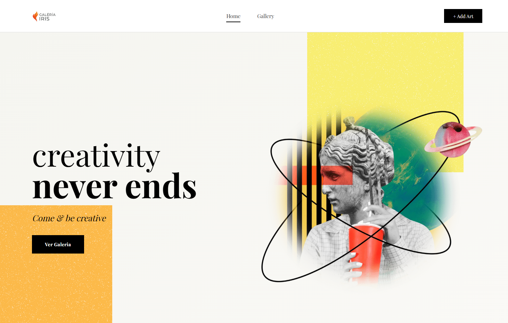

# 🎨 Proyecto Astato: Galería Web de Arte Dinámica

## 🌟 Descripción del Proyecto

Este proyecto es una **Galería de Arte Digital** dinámica, desarrollada como parte del módulo **DAW2** (Desarrollo de Aplicaciones Web) de **ILERNA BCN**.

El objetivo principal es construir una plataforma interactiva que permita a los usuarios explorar obras de arte, a la vez que ofrece funcionalidades de administración y gestión de contenido para los creadores. El proyecto utiliza una arquitectura basada en PHP para manejar la lógica del servidor y la persistencia de datos (simulada o real).

## ✨ Características y Funcionalidades

El proyecto implementa las siguientes características clave:

* **Autenticación de Usuarios:** Módulos de **Inicio de Sesión** (`login.php`) y **Registro** (`singUp.php`).
* **Gestión de Contenido:** Formulario `addArt.php` para la subida de nuevas obras, incluyendo la selección de color para categorización.
* **Galería Dinámica:** La página principal (`index.php`) muestra la colección de obras, probablemente cargando datos desde el directorio `data`.
* **Efectos Visuales Modernos:** Uso de la librería **ScrollReveal** para integrar animaciones fluidas a medida que el usuario navega por la galería.
* **Diseño Modular:** Uso de la carpeta `includes` para fragmentos de código reutilizables (ej. cabeceras, navegación).

## 🛠️ Tecnologías Utilizadas

Este proyecto combina tecnologías *front-end* y *back-end* para ofrecer una experiencia completa:

| Categoría | Tecnología | Uso Específico |
| :--- | :--- | :--- |
| **Backend** | **PHP** | Lógica del servidor, manejo de sesiones, gestión de formularios (`login.php`, `addArt.php`). |
| **Estructura** | **HTML** | Estructura semántica de todas las vistas del proyecto (`index.php`, `views/*`). |
| **Estilismo** | **CSS** | Diseño *responsive* de la galería y estilización de componentes. |
| **Interactividad** | **JavaScript (ES6+)** | Lógica *front-end* avanzada y manejo de eventos. |
| **Librerías** | **ScrollReveal.js** | Implementación de animaciones al desplazar (*reveal animations*). |

## ⚙️ Estructura del Directorio

El proyecto sigue una estructura limpia y organizada:

├── assets/
│   └── images/          # Imágenes de diseño (logos, iconos)
├── css/                 # Hojas de estilo del proyecto
├── data/                # Archivos para la persistencia de datos (ej. galeria.txt)
├── img/                 # Imágenes de las obras de arte
├── includes/            # Fragmentos de código PHP reutilizables
├── js/                  # Archivos JavaScript (incluyendo ScrollReveal)
├── views/               # Plantillas o vistas modulares
├── addArt.php           # Formulario para añadir nuevas obras
├── index.php            # Página principal de la galería
├── login.php            # Módulo de inicio de sesión
└── singUp.php           # Módulo de registro de nuevos usuarios

##  🌟 Vista previa de la pagina

## 👨‍💻 Equipo de Desarrollo

Este proyecto fue desarrollado por el **Equipo Astato** para ILERNA BCN.

| Rol | Miembros del Equipo |
| :--- | :--- |
| Desarrollador | [Fabian lugo] |
| Desarrollador | [Aaron Evangelista] |
